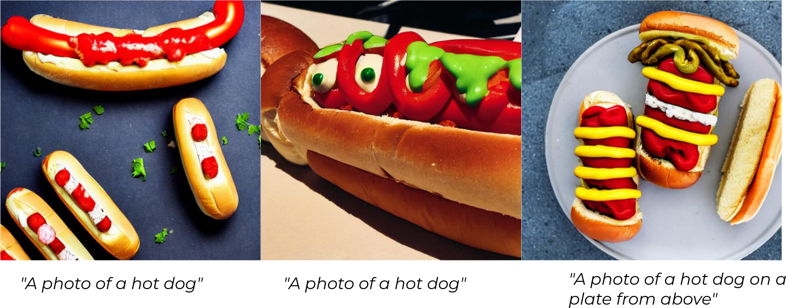
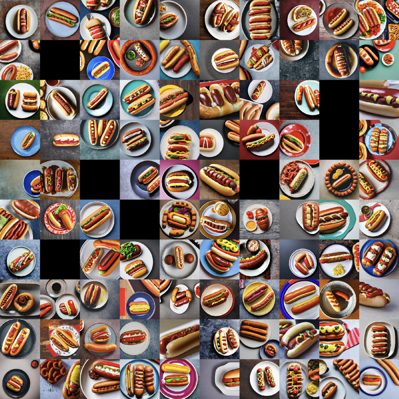
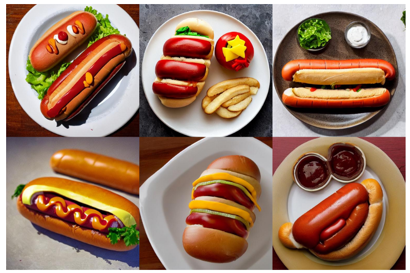
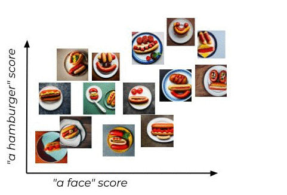

# Stable Diffusion과 의미 검색으로 대규모 이미지 태깅/검색하기

이미지 생성 모델은 빠르게 발전해 왔습니다. Stable Diffusion은 자연어 프롬프트를 입력하면 그 설명과 맞는 고품질 이미지를 생성합니다. 이 예제는 `"A photo of a hot dog"` 프롬프트로 생성한 대량의 핫도그 이미지를 Marqo에 인덱싱하고, 의미 검색으로 정리/태깅/탐색하는 흐름을 보여 줍니다.

전체 코드는 [`hot-dog-100k.py`](hot-dog-100k.py)에 있으며, 데이터셋은 원문 링크의 Google Drive 자료를 기준으로 합니다.

<p align="center">
  
</p>

## hot-dog 100k 데이터셋

같은 프롬프트에서 모델이 얼마나 다양한 이미지를 만드는지 확인하기 위해 Hugging Face [diffusers](https://github.com/huggingface/diffusers)를 사용했습니다. 원래 목표는 하루에 100만 장이었지만 속도 제약으로 약 93,000장의 이미지를 생성했습니다.

<p align="center">
  
</p>

샘플을 보면 "핫도그"라는 개념을 모델이 매우 다양하게 해석한다는 점을 확인할 수 있습니다.

## 데이터셋 인덱싱

Marqo를 실행하고 Python 클라이언트를 설치합니다.

```bash
pip install marqo
docker pull marqoai/marqo:latest
docker run --name marqo -it -p 8882:8882 --add-host host.docker.internal:host-gateway marqoai/marqo:latest
```

이미지 파일을 Docker 안의 Marqo가 접근할 수 있도록 로컬 HTTP 서버를 띄우고, 각 이미지를 Marqo 문서로 변환합니다.

```python
import glob
import os
import subprocess
from marqo import Client

images_directory = "hot-dog-100k/"
docker_path = "http://host.docker.internal:8222/"

pid = subprocess.Popen(
    ["python3", "-m", "http.server", "8222", "--directory", images_directory],
    stdout=subprocess.DEVNULL,
    stderr=subprocess.STDOUT,
)

files = glob.glob(images_directory + "/*.jpg")
files_map = {os.path.basename(f): f for f in files}
files_docker = [f.replace(images_directory, docker_path) for f in files]
documents = [
    {"image_docker": file_docker, "_id": os.path.basename(file_docker)}
    for file_docker in files_docker
]
```

OpenCLIP 모델로 이미지 인덱스를 만듭니다.

```python
client = Client(url="http://localhost:8882")

settings = {
    "model": "open_clip/ViT-B-32/laion2b_s34b_b79k",
    "treatUrlsAndPointersAsImages": True,
}

client.create_index("hot-dogs-100k", settings_dict=settings)
responses = client.index("hot-dogs-100k").add_documents(
    documents,
    device="cuda",
    client_batch_size=50,
    tensor_fields=["image_docker"],
)
```

인덱스 통계를 확인합니다.

```python
print(client.index("hot-dogs-100k").get_stats())
```

## 검은 이미지 제거

일부 생성 이미지는 안전 필터 때문에 검은 이미지로 남을 수 있습니다. 자연어 `"a black image"`로 검색하면 이런 이미지를 찾을 수 있고, 가장 가까운 중복 이미지를 다시 이미지 검색으로 찾아 제거할 수 있습니다.

```python
index_name = "hot-dogs-100k"
query = "a black image"

results = client.index(index_name).search(query)
results = client.index(index_name).search(results["hits"][0]["image_docker"], limit=100)

documents_delete = [r["_id"] for r in results["hits"] if r["_score"] > 0.99999]
client.index(index_name).delete_documents(documents_delete)
```

<p align="center">
  
</p>

## zero-shot 태깅

이미지들을 `"one hot dog"`, `"two hot dogs"`, `"a hamburger"`, `"a face"` 같은 텍스트 라벨과 비교하면 zero-shot 분류 점수를 만들 수 있습니다.

```python
index_name = "one_dog_two"

labels = [
    {"label": "one hot dog"},
    {"label": "two hot dogs"},
    {"label": "a hamburger"},
    {"label": "a face"},
]

label_strings = [list(a.values())[0] for a in labels]

settings = {
    "model": "open_clip/ViT-B-32/laion2b_s34b_b79k",
    "treatUrlsAndPointersAsImages": True,
}

client.create_index(index_name, settings_dict=settings)
client.index(index_name).add_documents(labels, tensor_fields=["label"])

for doc in documents:
    responses = client.index(index_name).search(doc["image_docker"], device="cpu")
    for lab in label_strings:
        doc[lab.replace(" ", "_")] = [
            r["_score"] for r in responses["hits"] if r["label"] == lab
        ][0]
```

<p align="center">
  
</p>

## 인덱스 업데이트

계산한 점수를 기존 문서에 추가해 다시 인덱싱하면 이미지마다 라벨 점수를 함께 저장할 수 있습니다.

```python
documents_image_docker = [doc.pop("image_docker") for doc in documents]
responses = client.index("hot-dogs-100k").add_documents(
    documents,
    device="cpu",
    client_batch_size=50,
    tensor_fields=["image_docker"],
)
```

## latent space 애니메이션

검색 결과를 따라 가장 가까운 이미지를 반복적으로 찾으면 벡터 공간 위를 걷는 것처럼 이미지를 정렬할 수 있습니다. 이 순서를 이용해 데이터셋의 변화를 애니메이션으로 만들 수 있습니다.

<p align="center">
  
</p>

```python
results = client.index("hot-dogs-100k").search(
    "a photo of a smiling face",
    filter_string="a_face:[0.58 TO 0.99]",
)

index = [ind for ind, doc in enumerate(documents) if doc["_id"] == results["hits"][0]["_id"]][0]
current_document = documents[index]
ordered_documents = [current_document["_id"]]

for i in range(len(documents)):
    client.index(index_name).delete_documents([current_document["_id"]])
    results = client.index(index_name).search(
        current_document["image_docker"],
        filter_string="a_face:[0.58 TO 0.99]",
        searchabel_attributes=["image_docker"],
        device="cuda",
    )
    next_document = results["hits"][0]
    ordered_documents.append(next_document["_id"])
    current_document = next_document

ordered_images = [files_map[f] for f in ordered_documents]
```

<p align="center">
  
</p>

## 마무리

Marqo를 사용하면 생성 이미지처럼 구조화되지 않은 대규모 멀티모달 데이터를 검색 가능한 형태로 만들 수 있습니다. 자연어 검색, 이미지 검색, zero-shot 라벨링, 점수 기반 필터링을 조합하면 데이터셋 정리와 탐색을 훨씬 빠르게 진행할 수 있습니다.
